# 🏰 LangGraph BookRobot Kingdom - Pseudocode & Flowchart

## 🧠 PSEUDOCODE

### **🏗️ System Initialization**
```
PROCEDURE InitializeRobotKingdom():
    CREATE embeddings_model = HuggingFaceEmbeddings("all-MiniLM-L6-v2")
    SET memory_box = NULL
    
    // Build the LangGraph workflow
    CREATE workflow = StateGraph(BookRobotState)
    
    // Add robot nodes
    ADD_NODE(workflow, "librarian", librarian_function)
    ADD_NODE(workflow, "detective", detective_function)  
    ADD_NODE(workflow, "writer", writer_function)
    ADD_NODE(workflow, "wisdom", wisdom_function)
    ADD_NODE(workflow, "king", king_function)
    
    // Define workflow connections
    ADD_EDGE(workflow, START → "librarian")
    ADD_EDGE(workflow, "librarian" → "detective")
    ADD_CONDITIONAL_EDGE(workflow, "detective" → decision_function)
    ADD_EDGE(workflow, "writer" → "king")
    ADD_EDGE(workflow, "wisdom" → "king")
    ADD_EDGE(workflow, "king" → END)
    
    COMPILE workflow WITH memory_saver
    RETURN compiled_workflow
END PROCEDURE
```

### **📚 Book Processing Workflow**
```
PROCEDURE ProcessBook(book_content):
    INITIALIZE state = {
        question: "",
        book_content: book_content,
        book_chunks: [],
        relevant_info: "",
        // ... other state fields
    }
    
    // Only run librarian node for book processing
    CALL LibrarianNode(state)
    RETURN "Book processed successfully"
END PROCEDURE
```

### **❓ Question Answering Workflow**
```
PROCEDURE AskQuestion(user_question):
    PRINT "🏰 Starting LangGraph workflow..."
    
    INITIALIZE state = {
        question: user_question,
        book_content: "",  // Already processed
        step_count: 0,
        // ... initialize all state fields
    }
    
    // Execute the complete LangGraph workflow
    result = EXECUTE_WORKFLOW(compiled_workflow, state)
    
    RETURN result["final_answer"]
END PROCEDURE
```

### **🤖 Individual Robot Node Functions**

#### **📚 Librarian Robot Node**
```
FUNCTION LibrarianNode(state):
    PRINT "📚 LIBRARIAN ROBOT: Working..."
    SET relevant_chunks = []
    
    // Process book if needed
    IF state["book_content"] EXISTS AND memory_box is NULL:
        PRINT "Reading book..."
        chunks = SPLIT_TEXT(state["book_content"], chunk_size=500, overlap=50)
        memory_box = CREATE_VECTOR_STORE(chunks, embeddings)
        state["book_chunks"] = chunks
        PRINT "Book memorized!"
    END IF
    
    // Search for relevant information
    IF state["question"] EXISTS AND memory_box EXISTS:
        PRINT "Searching for relevant info..."
        relevant_chunks = SIMILARITY_SEARCH(memory_box, state["question"], k=3)
        relevant_text = JOIN(relevant_chunks)
        state["relevant_info"] = relevant_text
        PRINT "Found relevant sections!"
    END IF
    
    state["librarian_response"] = "Found " + LENGTH(relevant_chunks) + " sections"
    state["step_count"] = state["step_count"] + 1
    
    RETURN state
END FUNCTION
```

#### **🕵️ Detective Robot Node**
```
FUNCTION DetectiveNode(state):
    PRINT "🕵️ DETECTIVE ROBOT: Analyzing..."
    
    question_lower = LOWERCASE(state["question"])
    
    // Analyze question type using pattern matching
    IF question_contains(["who", "character", "person"]):
        question_type = "CHARACTER_IDENTIFICATION"
        analysis = "Question about people/characters"
        
    ELSE IF question_contains(["what", "describe", "explain"]):
        question_type = "DESCRIPTION_REQUEST"
        analysis = "Question wants description"
        
    ELSE IF question_contains(["why", "reason", "because"]):
        question_type = "REASONING_QUESTION"
        analysis = "Complex reasoning needed"
        
    // ... more question type analysis
    
    ELSE:
        question_type = "GENERAL_QUESTION"
        analysis = "General question about book"
    END IF
    
    state["question_type"] = question_type
    state["analysis"] = analysis
    state["detective_response"] = "Analysis: " + question_type
    state["step_count"] = state["step_count"] + 1
    
    RETURN state
END FUNCTION
```

#### **🔀 Decision Router Function**
```
FUNCTION RouteAfterDetective(state):
    question_lower = LOWERCASE(state["question"])
    
    // Complex questions go to Wisdom Robot
    IF question_contains(["why", "analyze", "meaning", "significance"]):
        RETURN "wisdom"
    ELSE:
        // Simple questions go to Writer Robot
        RETURN "writer"
    END IF
END FUNCTION
```

#### **✍️ Writer Robot Node**
```
FUNCTION WriterNode(state):
    PRINT "✍️ WRITER ROBOT: Crafting response..."
    
    question_type = state["question_type"]
    relevant_info = state["relevant_info"]
    
    SWITCH question_type:
        CASE "CHARACTER_IDENTIFICATION":
            response = WriteCharacterResponse(relevant_info)
        CASE "DESCRIPTION_REQUEST":
            response = WriteDescriptionResponse(state["question"], relevant_info)
        CASE "SUMMARY_REQUEST":
            response = WriteSummaryResponse(relevant_info)
        DEFAULT:
            response = WriteGeneralResponse(state["question"], relevant_info)
    END SWITCH
    
    state["writer_response"] = response
    state["step_count"] = state["step_count"] + 1
    
    RETURN state
END FUNCTION
```

#### **🧠 Wisdom Robot Node**
```
FUNCTION WisdomNode(state):
    PRINT "🧠 WISDOM ROBOT: Deep thinking..."
    
    // Create thoughtful, philosophical response
    wisdom_response = CREATE_WISDOM_RESPONSE(
        state["question"],
        state["relevant_info"],
        state["question_type"]
    )
    
    state["wisdom_response"] = wisdom_response
    state["step_count"] = state["step_count"] + 1
    
    RETURN state
END FUNCTION
```

#### **👑 King Robot Node**
```
FUNCTION KingNode(state):
    PRINT "👑 KING ROBOT: Final assembly..."
    
    team_reports = []
    
    // Collect all robot responses
    IF state["librarian_response"] EXISTS:
        ADD_TO_LIST(team_reports, "Librarian: " + state["librarian_response"])
    IF state["detective_response"] EXISTS:
        ADD_TO_LIST(team_reports, "Detective: " + state["detective_response"])
    IF state["writer_response"] EXISTS:
        ADD_TO_LIST(team_reports, "Writer: " + state["writer_response"])
    IF state["wisdom_response"] EXISTS:
        ADD_TO_LIST(team_reports, "Wisdom: " + state["wisdom_response"])
    
    // Create comprehensive final answer
    final_answer = "ROYAL TEAM RESPONSE: " + 
                   "Question: " + state["question"] + 
                   "Team Reports: " + JOIN(team_reports) + 
                   "Final Answer: [Comprehensive response]"
    
    state["final_answer"] = final_answer
    state["step_count"] = state["step_count"] + 1
    
    RETURN state
END FUNCTION
```

---

## 📊 FLOWCHART

```mermaid
flowchart TD
    Start([🚀 START]) --> Init{Initialize<br/>Robot Kingdom?}
    
    Init -->|Yes| SetupGraph[🏗️ Setup LangGraph<br/>• Create StateGraph<br/>• Add robot nodes<br/>• Define edges<br/>• Compile workflow]
    
    SetupGraph --> BookOrQuestion{Book Processing<br/>or Question?}
    
    BookOrQuestion -->|📚 Book| ProcessBook[📚 Process Book<br/>• Split into chunks<br/>• Create vector store<br/>• Store embeddings]
    
    BookOrQuestion -->|❓ Question| StartWorkflow[🏰 Start LangGraph<br/>Workflow]
    
    ProcessBook --> BookDone[✅ Book Ready<br/>Wait for questions]
    
    StartWorkflow --> Librarian[📚 LIBRARIAN NODE<br/>• Search vector store<br/>• Find relevant chunks<br/>• Extract information]
    
    Librarian --> Detective[🕵️ DETECTIVE NODE<br/>• Analyze question type<br/>• CHARACTER_ID?<br/>• DESCRIPTION?<br/>• REASONING?<br/>• SUMMARY?]
    
    Detective --> Decision{🤔 Decision Point<br/>Complex or Simple?}
    
    Decision -->|Simple Questions<br/>who, what, where| Writer[✍️ WRITER NODE<br/>• Craft clear response<br/>• Format nicely<br/>• Use relevant info]
    
    Decision -->|Complex Questions<br/>why, analyze, meaning| Wisdom[🧠 WISDOM NODE<br/>• Deep analysis<br/>• Philosophical insights<br/>• Thoughtful reflection]
    
    Writer --> King[👑 KING NODE<br/>• Collect all responses<br/>• Create final answer<br/>• Comprehensive summary]
    
    Wisdom --> King
    
    King --> End([🏁 END<br/>Return Final Answer])
    
    BookDone --> StartWorkflow
    
    %% Styling
    classDef startEnd fill:#e1f5fe,stroke:#0277bd,stroke-width:3px
    classDef process fill:#f3e5f5,stroke:#7b1fa2,stroke-width:2px
    classDef decision fill:#fff3e0,stroke:#ef6c00,stroke-width:2px
    classDef robot fill:#e8f5e8,stroke:#2e7d32,stroke-width:2px
    
    class Start,End startEnd
    class SetupGraph,ProcessBook,BookDone process
    class Init,BookOrQuestion,Decision decision
    class Librarian,Detective,Writer,Wisdom,King robot
```



---

## 🔄 STATE FLOW DIAGRAM


---

## 🎯 KEY CONCEPTS SUMMARY

### **🏗️ LangGraph Architecture**
- **StateGraph**: Main workflow container
- **START/END**: Clear workflow boundaries  
- **Nodes**: Individual robot functions
- **Edges**: Connections between robots
- **Conditional Edges**: Smart routing decisions

### **📊 State Management**
- **TypedDict**: Structured state definition
- **Shared State**: All robots access same data
- **State Flow**: Data flows through each node
- **Immutable Updates**: Each node returns updated state

### **🤖 Robot Specialization**
- **Librarian**: Information retrieval specialist
- **Detective**: Question analysis expert  
- **Writer**: Response formatting specialist
- **Wisdom**: Deep analysis philosopher
- **King**: Coordination and final assembly

### **🔀 Dynamic Workflow**
- **Conditional Routing**: Detective decides next robot
- **Parallel Paths**: Writer OR Wisdom (not both)
- **Sequential Flow**: Most nodes run in sequence
- **Error Handling**: Built-in LangGraph features

This pseudocode and flowchart show how LangGraph orchestrates a team of specialized AI agents working together in a structured, intelligent workflow! 🚀