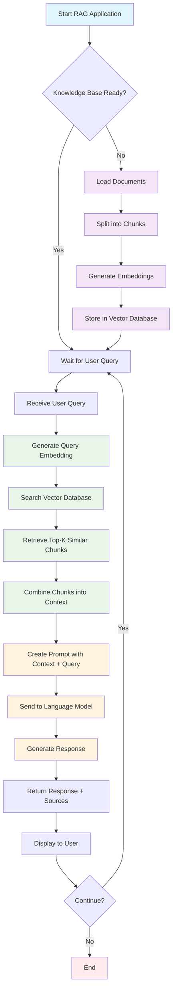

# RAG (Retrieval-Augmented Generation) Application

## Overview
This document provides a basic pseudocode implementation and flowchart for a Retrieval-Augmented Generation (RAG) application. RAG combines the power of information retrieval with generative AI to provide accurate, contextually relevant responses based on a knowledge base.

## Architecture Flow



## Pseudocode Implementation

### Data Preparation Phase

```pseudocode
FUNCTION prepare_knowledge_base():
    documents = load_documents_from_source()
    
    FOR each document in documents:
        chunks = split_document_into_chunks(document, chunk_size=500)
        
        FOR each chunk in chunks:
            embedding = generate_embedding(chunk.text)
            store_in_vector_database(chunk.text, embedding, chunk.metadata)
    
    RETURN "Knowledge base prepared"
```

### Query Processing Phase

```pseudocode
FUNCTION process_user_query(user_question):
    // Step 1: Generate query embedding
    query_embedding = generate_embedding(user_question)
    
    // Step 2: Retrieve relevant documents
    relevant_chunks = vector_database.similarity_search(
        query_embedding, 
        top_k=5
    )
    
    // Step 3: Create context from retrieved chunks
    context = ""
    FOR each chunk in relevant_chunks:
        context += chunk.text + "\n"
    
    // Step 4: Generate prompt for LLM
    prompt = create_prompt_template(user_question, context)
    
    // Step 5: Generate response using LLM
    response = llm.generate(prompt)
    
    RETURN response, relevant_chunks
```

### Main Application Flow

```pseudocode
FUNCTION main():
    // Initialize components
    vector_database = initialize_vector_db()
    embedding_model = load_embedding_model()
    llm = load_language_model()
    
    // Prepare knowledge base (one-time setup)
    IF knowledge_base_empty():
        prepare_knowledge_base()
    
    // Handle user interactions
    WHILE application_running:
        user_question = get_user_input()
        
        IF user_question == "exit":
            BREAK
        
        response, sources = process_user_query(user_question)
        
        display_response(response)
        display_sources(sources)
```

### Helper Functions

```pseudocode
FUNCTION create_prompt_template(question, context):
    template = """
    Context: {context}
    
    Question: {question}
    
    Please answer the question based on the provided context. 
    If the answer cannot be found in the context, say so.
    """
    RETURN template.format(context=context, question=question)

FUNCTION split_document_into_chunks(document, chunk_size):
    // Split document with overlap for better context preservation
    chunks = []
    overlap = chunk_size * 0.2  // 20% overlap
    
    FOR i = 0 to length(document.text) step (chunk_size - overlap):
        chunk_text = document.text[i:i+chunk_size]
        chunk = create_chunk(chunk_text, document.metadata)
        chunks.append(chunk)
    
    RETURN chunks
```

## Key Components

### Required Technologies
- **Vector Database**: Pinecone, Weaviate, Chroma, or FAISS
- **Embedding Model**: OpenAI embeddings, sentence-transformers, or similar
- **Language Model**: GPT-4, Claude, Llama, or other LLMs
- **Document Processing**: Text splitting, metadata handling

### Process Flow Explanation

1. **Data Preparation** (Purple):
   - Load documents from various sources
   - Split documents into manageable chunks
   - Generate embeddings for semantic search
   - Store in vector database

2. **Query Processing** (Green):
   - Convert user query to embedding vector
   - Perform similarity search in vector database
   - Retrieve most relevant document chunks

3. **Response Generation** (Orange):
   - Combine retrieved context with user query
   - Generate structured prompt for LLM
   - Produce contextually informed response

## Implementation Considerations

- **Chunk Size**: Balance between context preservation and processing efficiency
- **Overlap**: Include overlap between chunks to maintain context continuity
- **Retrieval Strategy**: Consider hybrid search (semantic + keyword)
- **Response Quality**: Implement relevance filtering and response validation
- **Scalability**: Design for concurrent users and large document collections

## Future Enhancements

- Conversation memory for multi-turn dialogues
- Query preprocessing and intent detection
- Response post-processing and fact-checking
- Advanced retrieval strategies (re-ranking, query expansion)
- Performance monitoring and analytics

---

*This pseudocode provides a foundation for implementing a RAG application. Adapt the structure based on your specific use case and technical requirements.*